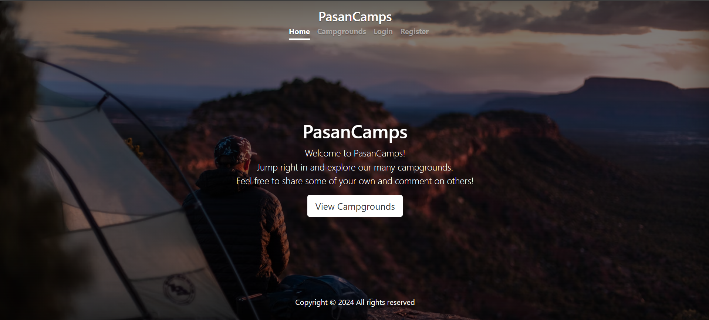

# PasanCamps

#### Discover and review the best campsites around the world with PasanCamps!




## Table of Contents

- [About](#about)
- [Features](#features)
- [Installation](#installation)
- [Usage](#usage)
- [Technologies Used](#technologies-used)
- [Contributing](#contributing)
- [License](#license)
- [Contact](#contact)

## About

PasanCamps is a web application that allows users to review campsites. Users can view details, post reviews, and share their experiences with the camping community.

This project is hosted at [PasanCamps on Render](https://pasancamps.onrender.com/). Please note that the site may load slowly due to the limitations of the free hosting plan.

## Features

### User Authentication and Authorization

- **Registration and Login:** Users can create an account and log in to the application.
- **Authorization:** Only authenticated users can create, edit, or delete campsites and reviews. Different levels of permissions ensure secure and appropriate access control.

### CRUD Operations for Campsites and Reviews

- **Create:** Users can add new campsites with details such as name, location, description, and images.
- **Read:** Users can browse and view detailed information about various campsites, including reviews left by other users.
- **Update:** Users can edit the details of their own campsites and reviews.
- **Delete:** Users can delete their own campsites and reviews if necessary.

### Image Upload Functionality

- **Upload Images:** Users can upload images for their campsites to provide a visual representation.
- **Image Storage:** Uploaded images are stored securely using Cloudinary, ensuring they are accessible and properly managed.

### User-Friendly Interface

- **Responsive Design:** The website is designed to be responsive, providing a seamless experience on both desktop and mobile devices.
- **Navigation:** Intuitive navigation allows users to easily find and manage campsites and reviews.
- **Interactive Elements:** Engaging UI elements enhance the user experience, making the site easy and enjoyable to use.

## Installation

1. Clone the repository:
    ```sh
    git clone https://github.com/PasanMadhuranga/PasanCamps.git
    ```
2. Navigate to the project directory:
    ```sh
    cd PasanCamps
    ```
3. Install the dependencies:
    ```sh
    npm install
    ```

## Usage

1. Start the server:
    ```sh
    npm start
    ```
2. Open your browser and visit `http://localhost:3000`.

## Technologies Used

- **Backend:** Node.js, Express.js
- **Frontend:** EJS, CSS
- **Database:** MongoDB
- **Authentication:** Passport.js
- **File Upload:** Cloudinary

## Contributing

Contributions are welcome! Please follow these steps to contribute:

1. Fork the repository.
2. Create a new branch:
    ```sh
    git checkout -b feature/your-feature-name
    ```
3. Make your changes and commit them:
    ```sh
    git commit -m 'Add some feature'
    ```
4. Push to the branch:
    ```sh
    git push origin feature/your-feature-name
    ```
5. Create a new pull request.

## Contact

Pasan Madhuranga: [My Email](mailto:pasan3529@gmail.com)

Project Link: [PasanCamps](https://github.com/PasanMadhuranga/PasanCamps)
